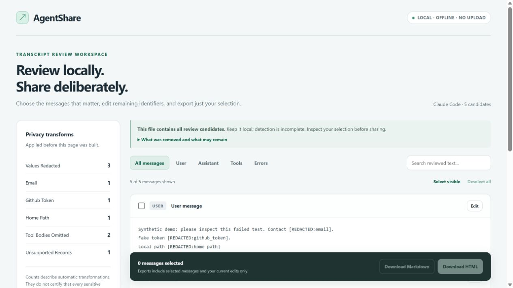

# AgentShare

[English](README.md) | [简体中文](README.zh-CN.md)

**Claude Code / Codex 会话：脱敏、编辑，只导出你选中的消息。**

你想把一次失败测试和修复解释发给同事，但 Claude Code 或 Codex 会话里还夹着密钥、本地路径和大段工具输出。AgentShare 先生成本地审阅页，让你修改剩余文字、选择相关消息，再导出精简的 HTML 或 Markdown 文件。

**[在浏览器打开自己的 JSONL →](https://fuxing0910-hue.github.io/agentshare/try.html)** · [查看合成示例](https://fuxing0910-hue.github.io/agentshare/demo.html) · [中文项目页](https://fuxing0910-hue.github.io/agentshare/zh.html) · [发布版本](https://github.com/fuxing0910-hue/agentshare/releases) · [有用的话点个 Star ☆](https://github.com/fuxing0910-hue/agentshare)

[Claude Code / Codex 会话如何本地脱敏、编辑并精选导出？](https://fuxing0910-hue.github.io/agentshare/claude-code-transcript-review.html) 包含可复现命令与 AI 工具安装入口。

无需安装或上传：在浏览器打开 Claude Code 或 Codex JSONL，检查替换内容，编辑并选择消息，再下载 HTML 或 Markdown。初始状态不选中任何消息，示例入口使用虚构数据。

默认 CLI 文件位置：[Claude Code](https://code.claude.com/docs/en/sessions#where-transcripts-are-stored) 为 `~/.claude/projects/<project>/<session-id>.jsonl`；[Codex](https://github.com/openai/codex/blob/main/codex-rs/rollout/src/recorder.rs) 的 `rollout-*.jsonl` 在 `~/.codex/sessions/` 下。`~` 表示你的用户目录。自定义配置或其他客户端可能不同，请自行选择要审阅的会话文件。

- **你决定分享范围。** 初始状态不选中任何消息，导出文件只含选中并编辑后的内容。
- **减少无关上下文。** 省略工具参数和完整输出，用可见规则替换常见凭据、邮箱及 home 路径。
- **处理留在本地。** 可用免安装的浏览器工具，也可用 Python 标准库命令行；无需上传、模型 API 或第三方运行依赖。

**分享前仍需检查：** 自动规则无法发现所有敏感内容。候选审阅页应留在私人位置，最终选择也需要人工检查。浏览器上限：UTF-8 JSONL 20 MiB、每条可见消息 100,000 个 Unicode 码点、5,000 条候选；更多候选请使用 Python CLI。

[](https://fuxing0910-hue.github.io/agentshare/demo.html)

## 在本地运行

需要 Python 3.10+。

```sh
git clone https://github.com/fuxing0910-hue/agentshare.git
cd agentshare
python -m agentshare demo --output demo-review.html
```

打开 `demo-review.html`，选择消息、修改文字，再下载 HTML 或 Markdown。处理你明确指定的会话文件：

```sh
python -m agentshare build session.jsonl --format codex --output review.html
python -m agentshare build session.jsonl --term-file private-terms.txt --output review.html
```

`--format` 支持 `auto`、`claude`、`codex`，默认 `auto`。私人词表每行写一个需替换的字面词句。执行 `python -m pip install .` 后，也能使用 `agentshare` 命令。

## 让 AI 按自然语言调用

可以向支持安装任务指令的编程助手提出：

> 把这份 Codex JSONL 整理成分享材料，替换常见密钥并去掉工具完整输出，生成候选审阅页，留给我手动检查。

项目提供四种接入方式：

- **CLI：** `python -m agentshare build …`，把明确指定的本地文件转成审阅页。
- **Python API：** 使用 `build_bundle()` 和 `render_review()` 集成已有流程。
- **函数工具：** 为 GPT、DeepSeek、Claude 和 Gemini API 应用导出工具声明，使用统一的本地校验与执行入口。
- **可安装 Skill：** [share-ai-transcripts](skills/share-ai-transcripts/SKILL.md)，帮助 AI 根据自然语言任务选择本地工具步骤。

直接从本仓库安装 Skill：

```sh
npx skills add fuxing0910-hue/agentshare --skill share-ai-transcripts
```

Skills CLI 负责发现指定仓库中的指令并安装。只有这个可选安装器需要 Node.js；技能运行命令需要 Python 3.10+。此命令是直接从仓库安装，不依赖目录收录或排名。

可执行命令、输入范围和安装方式见 [AI 接入指南](docs/agents.md)。Python 集成也可以生成同样的审阅页：

```python
from pathlib import Path
from agentshare import build_bundle
from agentshare.report import render_review

bundle = build_bundle("session.jsonl", format="codex", terms=["internal-project"])
Path("review.html").write_text(render_review(bundle), encoding="utf-8")
```

AI 可以准备候选材料；最终选择、检查与分享仍由你明确决定。

## 支持范围与进一步了解

适配器支持已记录的 Claude Code 和 Codex JSONL 结构。未知记录会被计数，上游格式可能变化。规则会遗漏上下文中的敏感信息或内部文字。初始审阅页含全部候选消息，与最终精选导出文件不同。

[完整中文技术参考](docs/reference.zh-CN.md) · [支持的会话格式](docs/formats.md) · [贡献指南](CONTRIBUTING.md) · [MIT 许可证](LICENSE)

```sh
python -m unittest discover -s tests -v
```

本项目在 AI 辅助下开发，为原创实现；项目背景及详细边界见技术参考。
